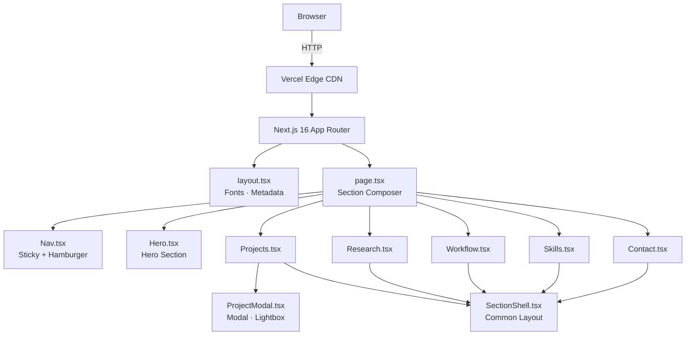

# portfolio-lp


---

## Overview

AI Engineer / Creator / Researcher として活動する宮川陽翔のポートフォリオサイト。  
現場の課題発見・AI活用・研究実績を一画面で伝えることを目的に、Next.js + Framer Motion でフルスクラッチ実装した Single-Page LP。

**Live:** https://portfolio-lp-chi.vercel.app

<!-- TODO: サイト全体のスクリーンショットを追加 -->

---

## Features

| | 機能 |
|---|---|
| ✅ | Hero セクション（キャッチコピー・プロフィールカード・コードブロック） |
| ✅ | Projects セクション（カード一覧 → モーダル詳細 → スクリーンショットライトボックス） |
| ✅ | Research セクション（国際会議論文の情報・IEEE リンク） |
| ✅ | Workflow セクション（AI 共創の 5 ステップフロー図） |
| ✅ | Skills セクション（技術スタック + LAPRAS プロフィールリンク） |
| ✅ | Contact セクション（GitHub / X / note / LAPRAS / Gmail への導線） |
| ✅ | Sticky Nav（スクロールで境界線が出現、スムーズスクロール） |
| ✅ | モバイルレスポンシブ（767px 以下でハンバーガーメニュー） |
| ✅ | スクロール連動アニメーション（`whileInView` で初回表示時のみ発火） |
| 🔲 | プロフィール写真（Hero 右カラムは現在プレースホルダー） |
| 🔲 | アクティブナビゲーション（現在地セクションのリンクハイライト） |
| 🔲 | OG 画像（SNS シェア時のサムネイル） |
| 🔲 | ダークモード |

---

## Tech Stack

| Category | Technology | Why |
|---|---|---|
| Framework | Next.js 16.2 (App Router) | SSG による高速配信。`next/font` でフォント最適化 |
| Language | TypeScript 5 | コンポーネント間の props 型安全性を担保 |
| Styling | Tailwind CSS 4 | グローバルな `.layout-*` クラスとメディアクエリでレスポンシブ制御 |
| Animation | Framer Motion 12 | `whileInView` / `whileHover` を宣言的に記述。spring アニメーション |
| Fonts | Noto Sans JP / JetBrains Mono / Manrope | 日本語本文 / コードブロック / 数字・英字見出し用に分離 |
| Hosting | Vercel | `main` push で自動デプロイ。Edge CDN で全世界配信 |

---

## Architecture



---

## Getting Started

**Prerequisites:** Node.js 20+, npm

```bash
git clone https://github.com/myfavoriteharuto-collab/portfolio-lp.git
cd portfolio-lp
npm install
npm run dev
```

`http://localhost:3000` をブラウザで開く。

環境変数は不要（全ページ静的生成、外部 API キーなし）。

### Other commands

```bash
npm run build    # Production build
npm run start    # Serve built output locally
npm run lint     # ESLint
```

---

## Implementation Notes

### SectionShell パターン

全セクション（Projects / Research / Workflow / Skills / Contact）は共通コンポーネント `SectionShell` を wrap する構成。

```
┌────────────────────────────────────┐
│ SectionShell                       │
│  ┌──────────┐  ┌───────────────┐  │
│  │ 200px    │  │ sidebar prop  │  │
│  │ 番号     │  │ （各セクション │  │
│  │ タイトル │  │  固有のコンテ │  │
│  │ リード   │  │  ンツ）       │  │
│  │ CTA      │  │               │  │
│  └──────────┘  └───────────────┘  │
└────────────────────────────────────┘
```

新セクションの追加は `SectionShell` を wrap して `sidebar` に JSX を渡すだけ。

### レスポンシブ設計の方針

コンポーネントの大部分がインラインスタイルで書かれているため、Tailwind のレスポンシブクラスが直接当てられない。  
そのため `globals.css` に `.layout-2col` / `.layout-5col` などのレイアウトクラスを定義し、`@media (max-width: 767px)` でグリッドを 1 列に折り畳む方式を採用。

### アニメーション設計

- **スクロール発火:** `whileInView={{ opacity: 1, y: 0 }}` + `viewport={{ once: true }}` で初回通過時のみ実行
- **インタラクション:** `whileHover={{ y: -4 }}` でカードの浮き上がり
- **装飾:** Hero の blob / sparkle のみ `animate` + `transition={{ repeat: Infinity }}` で常時ループ（他は静止）
- **モーダル:** `type: "spring", stiffness: 340, damping: 26` でバウンス感のある開閉

### CTA リンクの外部リンク対応

`SectionShell` に `ctaExternal?: boolean` prop を追加し、`true` のとき `target="_blank" rel="noopener noreferrer"` を付与。各セクションから渡すだけで安全な外部遷移になる。

---

## Roadmap

- [ ] プロフィール写真の追加（Hero 右カラムのプレースホルダーを差し替え）
- [ ] アクティブナビゲーション（`IntersectionObserver` でスクロール位置を検知しリンクをハイライト）
- [ ] Contact セクションにカレンダー予約リンクを追加（Calendly 等）
- [ ] LinkedIn リンクの追加（アカウント登録後）
- [ ] OG 画像の設定（`next/og` で動的生成）
- [ ] ダークモード対応（CSS 変数を切り替える方式）

---

## License

[MIT](./LICENSE) © 2026 Haruto Miyakawa
